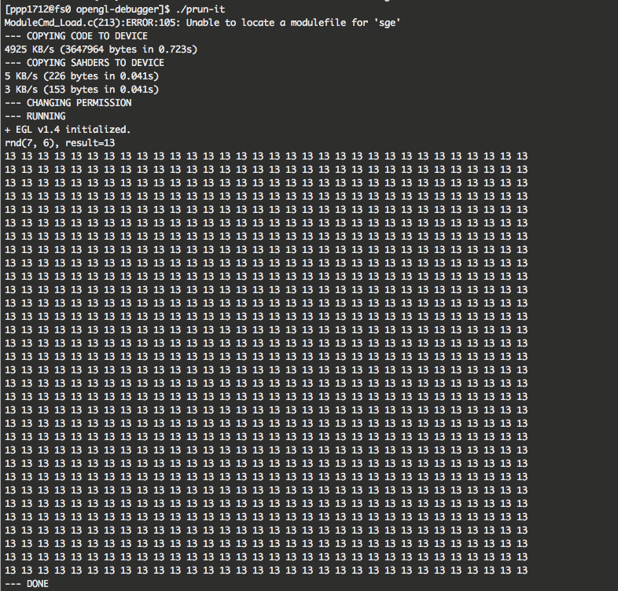

# OpenGL Debugger

## How to Run 

```bash
# 1. Compile 
NDK_PROJECT_PATH=. ndk-build NDK_APPLICATION_MK=./Application.mk
# 2. Transfer all Binaries and shaders to the DAS node. 
scp ./obj ... 
scp ./shaders ... 
# 3. Run from the headnode. Calls prun internaly.
./prun-it
# Note that with prun script, shaders will be copied to `/data/local/tmp/papa/shaders/tr.*`.
# Make sure that this directory exists.
# 4. if you are on a node directly connected to the device, directly run ./_prun-it
```

## Screenshots




# Kernel-Info

## How to Run  

```bash
# 1. Compile 
NDK_PROJECT_PATH=. ndk-build NDK_APPLICATION_MK=./Application.mk
# 2. Transfer all needed files to DAS4. In this case only the `./obj` folder
scp ... 
# 3. Run from the headnode. Calls prun internaly.
./prun-it
# 4. if you are on a node directly connected to the device, directly run ./_prun-it
```

## Notes

- We always used the top level `prun.sh`. Though, it cannot dump the files. Hence: 
	- to generate a new set of dumps, a folder name `dumps` must exist next to the binary
	- All files (`pagemap.dump`, `array.dump`, `kgsl.dump`) should be `touch`ed before execution in the folder and given full permission.
	- Dumps must be enbaled from the `Android.mk` file via `-DDUMP`.

- Change `#define NUM_TEXTURES (32*KB)` to allocate more textures, in cases no large chunks are found. In our cases, this number worked best and almost always found 1 or 2 64 page chunks. 

## Dump files 

- The 3 files wanted by the assignment are `kgsl.dump`, `pagemap.dump` and `array.dump`. The only difference is that in case multiple chunks of order 6 are found, they are all stored in that single `array.dump`. Following the ids is enough to find the margin.
- Other dumps are additional and show our logs. As an example, the following describes the `48.dump`

```
// name of the file implies that 48k pages are allocated 

// start of the log 
// line 7. raw log of the kgsl file.
+ KGSLEntry[0+0=0] = {id: 49175, useraddr: 82c8c000, pfn: 565c, alloc_order: 0}
+ KGSLEntry[0+1=1] = {id: 49174, useraddr: 82c8e000, pfn: 565b, alloc_order: 0}
+ KGSLEntry[0+2=2] = {id: 49173, useraddr: 82c90000, pfn: 565a, alloc_order: 0}
+ ... 
+ ... 


// line 49160. dump the entire kgsl, this time sorted and with correct alloc_orders.
++ Created 49152 textures and found 49156 in the file. Approximate size 192 MB
++ dumping sorted entries with pfn values
+ KGSLEntry[0+0=0] = {id: 11, useraddr: b6380000, pfn: 66fae, alloc_order: 1}
+ ...
+ ...


// line 98313
// log the chunks that have order 6 or higher. In this case 2 are found.
// the number in [] shows the index in the **sorted** kgsl file.
// looking at the pfn, the order is clear. 

+ KGSLEntry[8389+0=8389] = {id: 8409, useraddr: ab848000, pfn: 62280, alloc_order: 64}
+ KGSLEntry[8389+1=8390] = {id: 8410, useraddr: ab846000, pfn: 62281, alloc_order: 63}
+ KGSLEntry[8389+2=8391] = {id: 8411, useraddr: ab844000, pfn: 62282, alloc_order: 62}
+ KGSLEntry[8389+3=8392] = {id: 8412, useraddr: ab842000, pfn: 62283, alloc_order: 61}
...
+ KGSLEntry[8389+61=8450] = {id: 8470, useraddr: ab74e000, pfn: 622bd, alloc_order: 3}
+ KGSLEntry[8389+62=8451] = {id: 8471, useraddr: ab74c000, pfn: 622be, alloc_order: 2}
+ KGSLEntry[8389+63=8452] = {id: 8472, useraddr: ab74a000, pfn: 622bf, alloc_order: 1}
+ KGSLEntry[8454+0=8454] = {id: 8474, useraddr: ab746000, pfn: 605c1, alloc_order: 63}
+ KGSLEntry[8454+1=8455] = {id: 8475, useraddr: ab744000, pfn: 605c2, alloc_order: 62}
...
+ KGSLEntry[8454+61=8515] = {id: 8535, useraddr: ab64c000, pfn: 605fe, alloc_order: 2}
+ KGSLEntry[8454+62=8516] = {id: 8536, useraddr: ab64a000, pfn: 605ff, alloc_order: 1}

```
