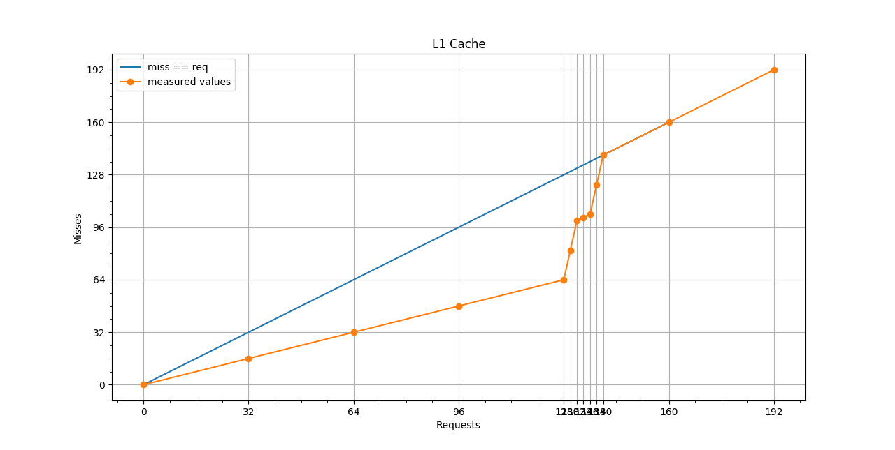
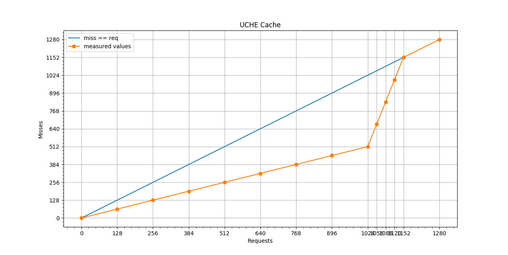

# Week 2 - Understanding the GPU

## How to Run

Same as week1. More info can be found in the local [README.md](./gpu-cache/README.md) file inside `gpu-cache` [directory](./gpu-cache/).

## Counters and Cache line size prediction 

For all experiments, a single point is drawn using `glDrawArrays(GL_POINTS, 0, 1);`. All memory reads are issued from the vertex shader and the fragment shader only outputs a constant value, as suggested in the paper.

For both caches, the essential information needed is the number of total requests and misses (hence, the hits can be concluded trivially). Having this pair of information, the same approach explained in the paper can be used to infer the cache size (nesting two loops and finding the upper bound of the inner loop where the 1/2 ratio breaks). Therefore, we specifically mention how these value (total requests and misses) can be obtained for each cache using AMD counters. 

#### L1 cache size 

To infer the L1 cache size, the following counters are used: 

```
group[9] = TP
    counters[1] = TPL1_TPPERF_TP0_L1_REQUESTS
    counters[2] = TPL1_TPPERF_TP0_L1_MISSES
    ...
```

for all TP units. Essentially: 

- `TPL1_TPPERF_TP0_L1_REQUESTS` is the total number of read requests sent from the shader to a specific TP. 
- `TPL1_TPPERF_TP0_L1_MISSES` is the total number of misses occurred in a TP. 
- `TPL1_TPPERF_TP0_L1_REQUESTS - TPL1_TPPERF_TP0_L1_MISSES` would then result in the number of hits.

> In all of our measurement, all four pairs of counters always had the same number of requests/misses. This led us to conclude that they --somehow-- are acting in parallel with an embedded synchrony. This conclusion is also used for the UCHE cache size prediction.

For more detailed information, refer to the [vertex shader code, ll:30-43](./gpu-cache/shaders/tr.vs).


#### UCHE (L2) cache size 

The UCHE cache counters are slightly more subtle and the direct hit/miss values are not readily available. After some preliminary experiments, fetching consecutive texels with different strides, the combination of the following counter was identified to be the most informative: 

```
group[9] = TP
    counters[1] = TPL1_TPPERF_TP0_L1_REQUESTS
group[8] = UCHE 
    counters[0] = UCHE_UCHEPERF_VBIF_READ_BEATS_TP
```

> Note that, as mentioned, using either of T1,T2,T3, or T4 as the group 9 counter representative does not make any substantial difference in the scope of this experiment.

Given that the correct stride value of L2 (equal to the UCHE cache line, *16 texels => 64 bytes*) is used, it is impossible for any of the fetches to have a hit in the *L1 cache*, simply because the stride is bigger than the L1 cache line. Hence, `TPL1_TPPERF_TP0_L1_REQUESTS` is yet again an indication of total requests that reach UCHE. Furthermore, the `UCHE_UCHEPERF_VBIF_READ_BEATS_TP` refers to the number of misses (and without the outer loop also requests because the stride is also NOT smaller than L2 cache line) *with a constant coefficient*. Observations show that this value is always multiplied by 16. Our main reason for this is that, as mentioned before, all 4 TP units, with their corresponding caches seem to be working in sync. Hence, a memory read from the shader, after being a miss in the L1 cache, would translate to four read requests when reaching L2, with each TP unit issuing a new one. Furthermore, each TP unit, when observing a cache miss, will try to fetch the entire cache line containing that specific texel, hence multiplying the read requests again by 4. Consecutively, this value is always multiplied by 16. 

Based on the above explanation, the number of requests and misses can be inferred. Hence, the same approach is in L1 can be used to craft two loops to infer the cache size of UCHE. 

For more detailed information, refer to the [vertex shader code, ll:45-82](./gpu-cache/shaders/tr.vs).

## Final Plots





## Appendix: All counters dump file

A list of all counters available in the used Android device can be found in `counters.log` file. 

